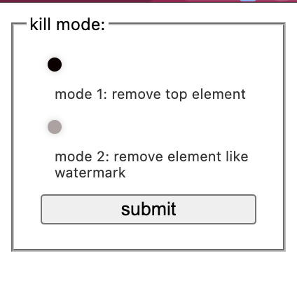

# WaterMark Killer

## A chrome plugin for removing the watermark layer of web pages

**How ​​to use**: Load the entire folder directly on the chrome plugin management page. **Instructions for use**:

- mode1: Remove the topmost element layer. Most simple web pages can be removed.
  
- mode2: Continuously remove elements whose class and ID names contain ambiguous watermarks, and prevent them from being generated again. (High performance consumption)
  

**Specially**: This tool is for learning use only, do not use it for illegal purposes.Commercial use not allowed##

## 一个用于移除网页水印层的chrome插件

**使用方式**：直接在chrome插件管理页面加载整个文件夹。

**使用说明**：

- mode1：移除最顶层的元素层。可以移除大多简单的网页。

- mode2：持续移除类和id名模糊包含watermark的元素，并阻拦其再次生成。（性能消耗大）

**特别地**：本工具仅用于学习使用，不要用于非法用途。不允许商用。

